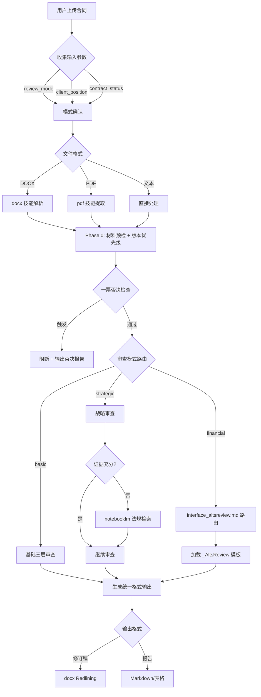

# Contract Review Skill 实施方案 v2

> **本版本已整合 Codex skill-creator 视角评审意见**
> 
> 备份日期：2026-02-02
> 
> ⚠️ **状态说明（2026-03-20）**：本文件为历史实施快照，路径与模式命名已过时。  
> 当前 canonical 结构以 `SKILL.md` + `references/loading_map_and_dependencies.md` + `DIRECTORY_GUIDE.md` 为准。

## 背景与目标

将合同审查能力产品化为独立技能，通过接口层联动 `_AltsReview`（金融产品）、`docx`、`pdf`、`notebooklm`。

---

## 设计决策（已确认）

| 决策项 | 结论 | 理由 |
|--------|------|------|
| 技能定位 | **独立 Skill** | 通用合同、制度审查、金融合同全覆盖，复用性最高 |
| 实际路径 | `_Skills/contract-review/` | 与 `_AltsReview` 同层，便于联动 |
| 金融模式 | 通过接口调用 `_AltsReview` | 不反向把合同审查塞进 _AltsReview 主流程 |

---

## 技能架构

```text
_Skills/contract-review/
├── SKILL.md                              # 主技能文件（canonical）
├── IMPLEMENTATION_PLAN.md                # 历史实施方案备份（非 canonical）
├── GOTCHAS.md                            # 高频翻车点
├── DIRECTORY_GUIDE.md                    # 目录边界说明
├── knowledge_base/
│   └── KNOWLEDGE_INDEX.md                # 知识索引（已迁移）
├── checklists/
│   ├── delivery_gate.md
│   ├── evidence_completeness.md
│   ├── veto_gate.md
│   └── output_style_gate.md
├── protocols/
│   ├── hard_constraints.md
│   ├── hard_rules.md
│   ├── evidence_schema.md
│   ├── version_priority.md
│   └── veto_list.md
├── templates/
│   ├── output_templates.md
│   ├── docx_revision_style.md
│   ├── docx_comment_style.md
│   ├── email_feedback_templates.md
│   ├── risk_grading_template.md
│   ├── meeting_brief_template.md
│   ├── panoramic_analysis_template.md
│   ├── delta_rationale_template.md
│   ├── nda_triage_template.md
│   └── playbook_template.md
├── references/
│   ├── checklist_basic.md
│   ├── checklist_strategic.md
│   ├── checklist_financial.md
│   ├── checklist_issuance.md
│   ├── checklist_standardized.md
│   ├── input_schema.md
│   ├── mode_selection.md
│   ├── workflow_phases.md
│   ├── output_requirements.md
│   ├── loading_map_and_dependencies.md
│   ├── interface_altsreview.md
│   └── methodology_fawu.md
└── scripts/
    ├── extract_contract_structure.py
    ├── docx_track_changes.py
    └── docx_commenter.py
```

---

## P0：硬性改进（已完成）

### input_schema.md

**显式输入参数**（强制要求用户提供或确认）:

| 参数 | 类型 | 必填 | 说明 |
|------|------|------|------|
| `review_mode` | `basic`/`strategic`/`financial` | ✅ | 审查深度模式 |
| `client_position` | `strong`/`weak`/`balanced` | ✅ | 客户议价地位 |
| `contract_status` | `draft`/`pending_sign`/`signed`/`sealed` | ✅ | 合同版本状态 |
| `industry` | string | ○ | 行业类型（可自动识别） |
| `next_scenario` | string | ○ | 下一场景描述 |

---

### hard_rules.md

**跨模式硬规则**（所有审查模式必须遵守）:

#### 禁止规则
1. 严禁编造法条（无法引用时标注【需人工复核】）
2. 严禁模糊表述（禁止"通常认为"/"一般理解为"）
3. 严禁越权定性（禁止输出"构成违法"等司法结论）
4. 严禁情绪化措辞（禁止"建议优化"/"应当高度重视"）

#### 法人独立性硬规则（升级为跨模式）
- **上市公司**：资金占用/违规担保检查
- **金融/类金融机构**：资产隔离/关联交易穿透
- **SPV/项目公司**：独立运营能力/实质控制权

#### 事实锚定规则
- 所有结论必须追溯到文档原文
- 文件内容与 AI 先验知识冲突时，以文件为准

---

### evidence_schema.md

**证据链字段规范**（每条审查意见必须包含）:

| 字段 | 说明 | 示例 |
|------|------|------|
| `clause_location` | 条款位置 | "第三章 第12条" |
| `original_text` | 原文摘录 | "配合省一级分支机构..." |
| `risk_consequence` | 风险后果 | "可能导致配合范围不足" |
| `legal_basis` | 法律/监管依据 | "《反洗钱法》第43条" |
| `basis_level` | 依据等级 | `L1_法律`/`L2_规章`/`L3_惯例` |
| `suggested_revision` | 建议改写 | "配合设区的市级以上..." |
| `priority` | 优先级 | `P0_阻断`/`P1_重要`/`P2_建议` |

---

## P1：尽快补充（已完成）

### version_priority.md

**版本冲突机制**（证据优先级）:

```
Level 1: 用印/签署版（最高效力）
Level 2: 最新补充协议/变更函
Level 3: 草稿/批注版本
Level 4: 推介材料/尽调问答
```

冲突处理：
- 低版本与高版本矛盾时，以高版本为准
- 需标注"待高版本文件落地确认"

---

### veto_list.md

**一票否决清单**（触发即阻断）:

| 类型 | 风险描述 | 后果 |
|------|----------|------|
| 隐债/平台 | 涉及地方政府隐性债务或融资平台 | 建议不予投资 |
| 资金用途不可监测 | 无法穿透资金最终流向 | 建议不予投资 |
| 法人独立性重大瑕疵 | SPV 无实质运营、资产混同 | 建议不予投资 |
| 核心授权缺失 | 担保/处分无有效授权决议 | 暂停审查，补齐后继续 |
| 强制执行效力存疑 | 公证/仲裁条款无效或不完整 | 降级为高风险标注 |

---

## P2：可后置（已完成）

### scripts/extract_contract_structure.py
- **范围**：仅做"章节树 + 关键条款定位"
- **不做**：复杂 NLP、语义分析
- **输出**：Markdown 格式的合同结构大纲

### notebooklm 调用策略
- **触发条件**：`strategic`/`financial` 模式 **且** 证据不足
- **目的**：避免上下文膨胀
- **用法**：法规检索、案例检索

---

## 技能调用流程



---

## GitHub Skill 借鉴点映射

| 借鉴点 | 来源 | 应用位置 |
|--------|------|----------|
| 三层审查模型 | Layer 1/2/3 | `checklist_basic.md` + SKILL.md Phase 2 |
| 仅批注原则 | Comment Principles | 硬约束（不修改原文） |
| 风险等级标记 | 🔴🟡🔵 | `output_templates.md` 优先级字段 |
| Mermaid 流程图 | Business Flowchart | 可选交付物 |
| 语言检测规则 | Language rule | SKILL.md 输出规范（已补充） |

---

## Verification Plan

### P0 验证
1. 输入参数缺失时，技能主动询问
2. 接口层路径映射正确加载 _AltsReview 模板
3. 每条意见包含完整证据链字段
4. 法人独立性检查在所有模式下触发

### P1 验证
1. 版本冲突时正确应用优先级
2. 一票否决项触发阻断并输出报告
3. 三套输出模板字段名一致

---
